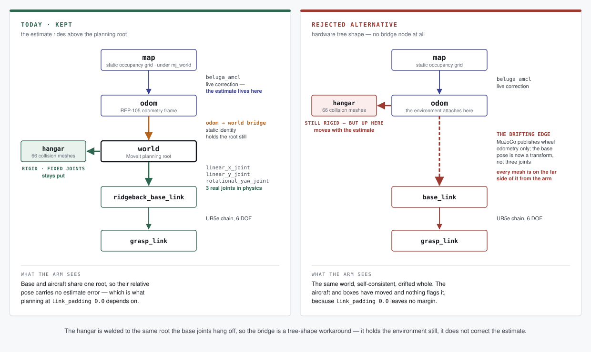

# hangar_sim

A MoveIt Pro MuJoCo simulation for PickNik's Universal Robots (UR) arms.

For detailed documentation see: [MoveIt Pro Documentation](https://docs.picknik.ai/)

Navigation uses nav2's MPPI controller with `open_loop: true` (see `params/nav2_params.yaml`), which needs `nav2_mppi_controller` 1.3.13 or newer. The workspace `Dockerfile` installs that build; older builds ignore the parameter without error and drive the base well below `vx_max`.

## Why the TF tree runs `odom -> world`

`world` is MoveIt's planning root *and* the link the hangar is welded to — 66 collision
meshes on fixed joints, the aircraft among them. The base's position is not a transform
anyone publishes: it is three real joints (`linear_x_joint`, `linear_y_joint`,
`rotational_yaw_joint`) hanging off that same root, driven by the physics model. So the
environment and the robot share one root, and the robot moves through a fixed world.

That is what makes the arm plannable here. The surface-following and box-handling
objectives plan at `link_padding` 0.0, and they get away with it because the aircraft
never moves relative to the base except by the base actually driving.

Navigation still needs a localized pose, so the estimate rides *above* the planning root:
`beluga_amcl` publishes a live `map -> odom`, and a static `odom -> world` bridge
(`launch/sim/robot_drivers_to_persist_sim.launch.py`) hangs the planning root under it.
The bridge holds the environment still; it is not correcting anything.

Re-parenting the sim to the hardware shape — `map -> odom -> base_link`, with MuJoCo
publishing wheel odometry only and `beluga_amcl` owning `map -> odom` — would need no
bridge at all. It was rejected because it drags the planning root, and therefore all 66
meshes, onto the drifting estimate: the aircraft moves, the boxes move, and the arm
planner cannot tell, because its whole world moved identically. **If the meshes didn't
drift with odom we wouldn't need this.** Interim, pending a TF redesign.

`test/test_planning_root_frame.py` pins that shape so a re-parent has to be deliberate.
